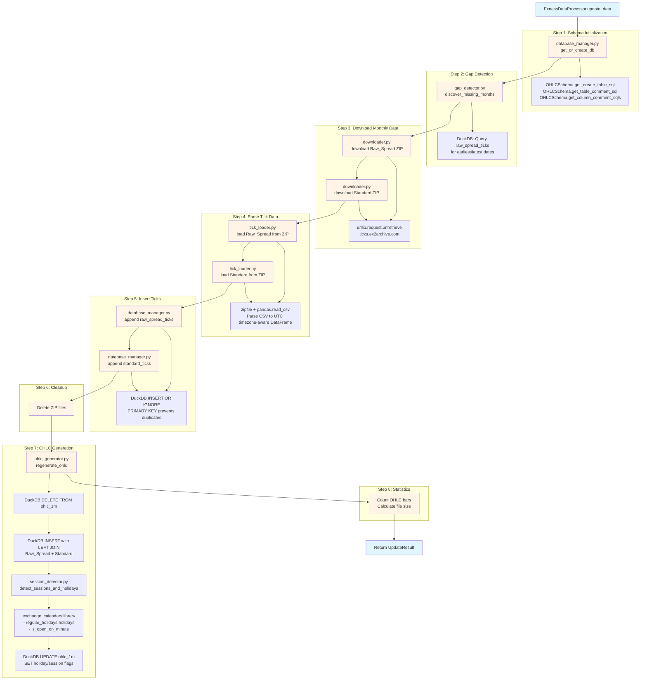
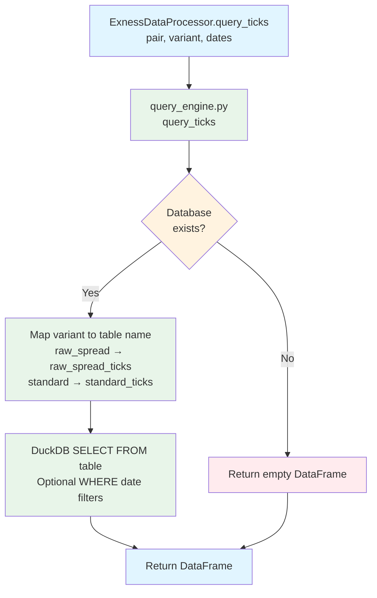
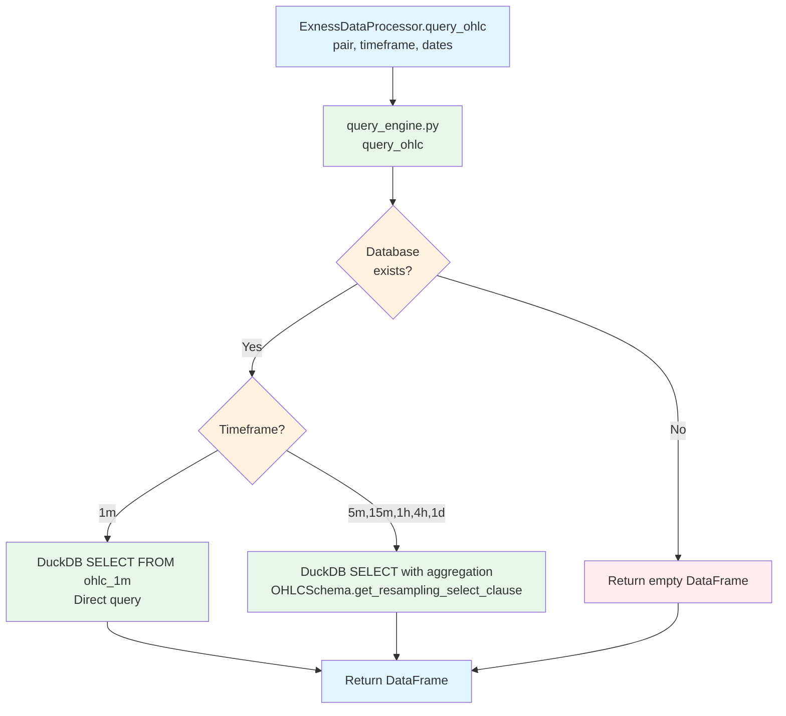

# Module Architecture

**Version**: v1.3.1 (Documentation Accuracy Update)
**Last Updated**: 2025-10-17
**Related**: [`README.md`](../README.md) - Architecture overview

---

## Changelog

### v1.3.1 (2025-10-17) - Documentation Accuracy Update
- Fixed module count: 6 instances + 1 static utility (was documented as 7)
- Corrected all constructor signatures (added base_dir/temp_dir parameters)
- Fixed HTTP library documentation (urllib.request, not httpx)
- Corrected query_engine.py method signatures (pair-based API, not duckdb_path-based)
- Updated return types to reflect Pydantic models (UpdateResult, CoverageInfo)
- Enhanced data flow diagrams with detailed Mermaid flowcharts
- Documented OHLCSchema integration pattern throughout modules
- Fixed type signatures (str vs datetime, timezone-aware timestamps)
- Clarified EXCHANGES registry location (separate exchanges.py module)
- Documented session_detector is called BY ohlc_generator (dependency injection)
- See [`docs/validation/ARCHITECTURE_AUDIT_2025-10-17.md`](validation/ARCHITECTURE_AUDIT_2025-10-17.md) for complete audit findings

### v1.3.0 (2025-10-16) - Facade Pattern Implementation
- Extracted 7 specialized modules from processor.py
- Implemented facade pattern with SLO-based design
- 48 tests passing, zero regressions

---

## Overview

The exness-data-preprocess codebase uses a **Facade Pattern** with 6 specialized module instances plus 1 static utility module, coordinated by a thin orchestrator (`processor.py`). Each module has a single responsibility and defines clear SLOs (Availability, Correctness, Observability, Maintainability).

**Design Principles**:
- **Facade Pattern**: processor.py delegates all operations to specialized modules
- **Separation of Concerns**: Each module has single, focused responsibility
- **SLO-Based Design**: All modules define Availability, Correctness, Observability, Maintainability contracts
- **Off-the-Shelf Libraries**: urllib, pandas, DuckDB, exchange_calendars (no custom implementations)
- **Zero Regressions**: All 48 tests pass after module extraction

**Module Instances** (6):
1. `ExnessDownloader(temp_dir)` - HTTP downloads
2. `DatabaseManager(base_dir)` - Database operations
3. `GapDetector(base_dir)` - Incremental update logic
4. `SessionDetector()` - Holiday and session detection
5. `OHLCGenerator(session_detector)` - OHLC generation
6. `QueryEngine(base_dir)` - Query operations

**Static Utility** (1):
7. `TickLoader` - CSV parsing (static methods only, no instantiation needed)

**Architecture Diagram**:
```
┌─────────────────────────────────────────────────┐
│           processor.py (Facade)                 │
│  Thin orchestrator coordinating workflow        │
└─────────────────────────────────────────────────┘
              ↓
    ┌─────────┴─────────┐
    │                   │
    ↓                   ↓
┌─────────────┐   ┌──────────────┐
│ downloader  │   │ tick_loader  │
│ .py         │   │ .py          │
└─────────────┘   └──────────────┘
    ↓                   ↓
┌─────────────────────────────────┐
│    database_manager.py          │
│  (DuckDB operations, schema)    │
└─────────────────────────────────┘
    ↓
┌──────────────┬─────────────┬──────────────┐
│ session_     │ gap_        │ ohlc_        │
│ detector.py  │ detector.py │ generator.py │
└──────────────┴─────────────┴──────────────┘
    ↓
┌─────────────────────────────────────────────────┐
│           query_engine.py                       │
│  Tick/OHLC queries, date filtering, resampling  │
└─────────────────────────────────────────────────┘
```

---

## Module 1: processor.py (Facade Orchestrator)

**File**: `src/exness_data_preprocess/processor.py`

**Role**: Thin orchestrator facade coordinating 7 specialized modules

**Pattern**: Facade Pattern - all public methods delegate to specialized modules

**Responsibilities**:
- Initialize 6 module instances + 1 static utility
- Coordinate workflow between modules
- Provide unified public API
- No business logic (all delegated to modules)

**Key Methods**:
- `__init__(base_dir: Optional[Path] = None)` - Initialize 6 module instances (downloader, database_manager, gap_detector, session_detector, ohlc_generator, query_engine) plus directory setup
- `download_exness_zip()` - Delegates to downloader module
- `_get_or_create_db()` - Delegates to database_manager module
- `_load_ticks_from_zip()` - Delegates to TickLoader static method
- `_append_ticks_to_db()` - Delegates to database_manager module
- `_discover_missing_months()` - Delegates to gap_detector module
- `update_data(...) -> UpdateResult` - Main workflow orchestrator (returns Pydantic model)
- `_regenerate_ohlc()` - Delegates to ohlc_generator module
- `query_ticks(...) -> pd.DataFrame` - Delegates to query_engine module
- `query_ohlc(...) -> pd.DataFrame` - Delegates to query_engine module
- `get_data_coverage(...) -> CoverageInfo` - Delegates to query_engine module (returns Pydantic model)

**SLOs**:
- **Availability**: Raises exceptions from delegated modules (no fallbacks)
- **Correctness**: Delegates validation to specialized modules
- **Observability**: Progress output via print statements (user-facing), module logs use Python logging library
- **Maintainability**: Thin facade (82% pure delegation, 18% orchestration), easy to add new modules

**Return Types**:
- `update_data()` → `UpdateResult` (Pydantic model with duckdb_path, months_added, raw_ticks_added, standard_ticks_added, ohlc_bars, duckdb_size_mb)
- `query_ticks()` → `pd.DataFrame` (tick data)
- `query_ohlc()` → `pd.DataFrame` (OHLC bars)
- `get_data_coverage()` → `CoverageInfo` (Pydantic model with earliest_date, latest_date, total_ohlc_bars, duckdb_size_mb)

**Module Statistics**: Run `make module-stats` to see current line count

---

## Module 2: downloader.py (HTTP Downloads)

**File**: `src/exness_data_preprocess/downloader.py`

**Role**: HTTP download operations for Exness ZIP files

**Responsibility**: Download Exness ZIP files from ticks.ex2archive.com

**Class**: `ExnessDownloader`

**Constructor**:
- `__init__(self, temp_dir: Path)` - Initialize with temporary directory for downloads

**Methods**:
- `download_zip(year: int, month: int, pair: str, variant: str) -> Optional[Path]`
  - Downloads ZIP file for specified parameters
  - Returns path to downloaded ZIP file (or existing file if already downloaded)
  - Returns `None` on download failure (prints error message)
  - **Note**: File existence check - returns existing file without re-downloading

**SLOs**:
- **Availability**: Returns None on HTTP errors with error message (no exceptions raised, no retries)
- **Correctness**: Validate URL patterns match Exness repository structure
- **Observability**: Progress output via print statements (file sizes, download status)
- **Maintainability**: Thin wrapper around urllib.request library (off-the-shelf)

**Dependencies**:
- urllib.request - HTTP download via `urlretrieve()`
- urllib.error - Error handling (`URLError`)
- pathlib - File path handling

**URL Pattern**:
```
https://ticks.ex2archive.com/ticks/{VARIANT}/{YEAR}/{MONTH}/Exness_{VARIANT}_{YEAR}_{MONTH}.zip
```

**Example**:
```python
downloader = ExnessDownloader()
zip_path = downloader.download_zip(2024, 9, "EURUSD", "Raw_Spread")
# Returns: Path to Exness_EURUSD_Raw_Spread_2024_09.zip
```

**Error Handling**:
- HTTP 404: Raise error (month doesn't exist)
- HTTP 500: Raise error (server error)
- Network timeout: Raise error (no retries)

---

## Module 3: tick_loader.py (CSV Parsing)

**File**: `src/exness_data_preprocess/tick_loader.py`

**Role**: Load tick data from ZIP files into pandas DataFrames

**Responsibility**: Parse CSV tick data from Exness ZIP files with microsecond-precision timestamps

**Class**: `TickLoader` (static utility, no instantiation needed)

**Constructor**: None (all methods are static)

**Methods**:
- `load_from_zip(zip_path: Path) -> pd.DataFrame` (static method)
  - Opens ZIP file, reads CSV in-memory (no temporary files)
  - Parses timestamps to **datetime64[ns, UTC]** (timezone-aware)
  - Two-step conversion: parse_dates → UTC localization
  - Returns DataFrame with columns: Timestamp (UTC timezone-aware), Bid, Ask
  - Raises ValueError on parsing errors

**SLOs**:
- **Availability**: Raise exceptions on CSV parsing errors (no fallback)
- **Correctness**: Validate timestamp parsing to microsecond precision
- **Observability**: Parsing error logging with line numbers
- **Maintainability**: Pure pandas implementation (off-the-shelf)

**Dependencies**:
- pandas - DataFrame operations
- zipfile - ZIP archive handling

**CSV Format**:
```csv
Timestamp,Bid,Ask
2024-09-01 00:00:01.123456,1.10234,1.10236
2024-09-01 00:00:01.234567,1.10235,1.10237
```

**Example**:
```python
df = TickLoader.load_from_zip(Path("Exness_EURUSD_Raw_Spread_2024_09.zip"))
# Returns DataFrame with ~815K rows, 3 columns
```

**Validation**:
- Timestamps must be monotonically increasing
- Bid and Ask must be positive floats
- No NULL values allowed

---

## Module 4: database_manager.py (Database Operations)

**File**: `src/exness_data_preprocess/database_manager.py`

**Role**: Database initialization, schema creation, tick insertion with duplicate prevention

**Responsibility**: Manage DuckDB database lifecycle and ensure schema integrity

**Class**: `DatabaseManager`

**Constructor**:
- `__init__(self, base_dir: Path)` - Initialize with base directory for database storage

**Methods**:
- `get_or_create_db(pair: str) -> Path`
  - Creates database if doesn't exist
  - Initializes schema with PRIMARY KEY constraints via **OHLCSchema class**
  - Schema creation: `OHLCSchema.get_create_table_sql()` → `OHLCSchema.get_table_comment_sql()` → `OHLCSchema.get_column_comment_sqls()`
  - Adds COMMENT ON statements for self-documentation
  - Returns path to database file

- `append_ticks(duckdb_path: Path, df: pd.DataFrame, table_name: str) -> int`
  - Appends tick data to specified table using **INSERT OR IGNORE** strategy
  - PRIMARY KEY prevents duplicates (silent ignore per DuckDB behavior)
  - Before/after count comparison to calculate rows actually inserted
  - Returns number of rows inserted (may be less than df length if duplicates)
  - Raises DuckDBError on schema mismatches

**SLOs**:
- **Availability**: Raise exceptions on database errors (no fallback)
- **Correctness**: Enforce schema integrity with PRIMARY KEY constraints
- **Observability**: DuckDB logging enabled, transaction logging
- **Maintainability**: Pure DuckDB library (off-the-shelf)

**Dependencies**:
- duckdb - Database library
- pandas - DataFrame integration

**Schema**:
```sql
-- raw_spread_ticks table
CREATE TABLE IF NOT EXISTS raw_spread_ticks (
    Timestamp TIMESTAMP WITH TIME ZONE NOT NULL,
    Bid DOUBLE NOT NULL,
    Ask DOUBLE NOT NULL,
    PRIMARY KEY (Timestamp)
);

-- standard_ticks table
CREATE TABLE IF NOT EXISTS standard_ticks (
    Timestamp TIMESTAMP WITH TIME ZONE NOT NULL,
    Bid DOUBLE NOT NULL,
    Ask DOUBLE NOT NULL,
    PRIMARY KEY (Timestamp)
);

-- ohlc_1m table (30 columns, Phase7 schema v1.6.0)
-- Created via OHLCSchema.get_create_table_sql()
-- See docs/DATABASE_SCHEMA.md for complete schema

-- metadata table
CREATE TABLE IF NOT EXISTS metadata (
    key VARCHAR PRIMARY KEY,
    value VARCHAR,
    updated_at TIMESTAMP WITH TIME ZONE DEFAULT NOW()
);
```

**Note**: All timestamp columns are **TIMESTAMP WITH TIME ZONE** (timezone-aware) for proper UTC handling

**Self-Documentation**:
- All tables have COMMENT ON TABLE statements
- All columns have COMMENT ON COLUMN statements
- Queryable via `duckdb_tables()` and `duckdb_columns()`

**Duplicate Handling**:
- PRIMARY KEY constraint automatically prevents duplicates
- No error raised on duplicate insert (silent ignore per DuckDB default)
- Enables safe incremental updates

---

## Module 5: session_detector.py (Holiday and Session Detection)

**File**: `src/exness_data_preprocess/session_detector.py`

**Role**: Detect holidays and trading sessions for 10 global exchanges

**Responsibility**: Use exchange_calendars library to detect US/UK/major holidays and global exchange trading sessions

**Class**: `SessionDetector`

**Constructor**:
- `__init__(self)` - No parameters, initializes 10 exchange calendars from **exchanges.py** module

**Methods**:
- `detect_sessions_and_holidays(dates_df: pd.DataFrame) -> pd.DataFrame`
  - Input: DataFrame with **both** `ts` column (timestamps) and `date` column (required schema)
  - Output: DataFrame with 13 additional columns:
    - `is_us_holiday` (BOOLEAN)
    - `is_uk_holiday` (BOOLEAN)
    - `is_major_holiday` (BOOLEAN)
    - `is_nyse_session` (BOOLEAN) - New York Stock Exchange
    - `is_lse_session` (BOOLEAN) - London Stock Exchange
    - `is_xswx_session` (BOOLEAN) - Swiss Exchange
    - `is_xfra_session` (BOOLEAN) - Frankfurt Stock Exchange
    - `is_xtse_session` (BOOLEAN) - Toronto Stock Exchange
    - `is_xnze_session` (BOOLEAN) - New Zealand Exchange
    - `is_xtks_session` (BOOLEAN) - Tokyo Stock Exchange
    - `is_xasx_session` (BOOLEAN) - Australian Securities Exchange
    - `is_xhkg_session` (BOOLEAN) - Hong Kong Exchange
    - `is_xses_session` (BOOLEAN) - Singapore Exchange

**Implementation Details**:
- **Holiday detection**: Pre-generates holiday sets for O(1) lookup performance using `calendar.regular_holidays.holidays()`
- **Session detection**: Uses `calendar.is_open_on_minute()` with timezone-aware timestamps for minute-level precision
- **Nested helper**: `is_trading_hour()` function handles timezone conversion automatically
- **Performance**: Set-based holiday checking, efficient minute-level session detection

**SLOs**:
- **Availability**: Raise exceptions on exchange_calendars errors (no fallback)
- **Correctness**: Use official exchange calendars with automatic DST handling via `is_open_on_minute()`
- **Observability**: Calendar initialization logging via print statements
- **Maintainability**: Thin wrapper around exchange_calendars library (off-the-shelf)

**Dependencies**:
- exchange_calendars - Official exchange trading calendars (10 exchanges)
- **exchanges.py module** - EXCHANGES registry dict (not in session_detector.py)

**Exchange Coverage**:
- **10 global exchanges** from **exchanges.py** module covering 24-hour forex trading
- **Automatic DST handling** via exchange_calendars.is_open_on_minute()
- **Automatic lunch break handling** (Tokyo 11:30-12:30, HK/Singapore 12:00-13:00)
- **Holiday detection** for US (NYSE calendar), UK (LSE calendar), and major overlaps

**Use Case**: Phase7 OHLC schema (v1.6.0) includes session flags for regime detection

**Example**:
```python
detector = SessionDetector()
dates_df = pd.DataFrame({'date': pd.date_range('2024-09-01', '2024-09-30')})
result = detector.detect_sessions_and_holidays(dates_df)
# Returns DataFrame with 13 additional boolean columns
```

---

## Module 6: gap_detector.py (Incremental Update Logic)

**File**: `src/exness_data_preprocess/gap_detector.py`

**Role**: Discover missing months for incremental database updates

**Responsibility**: Compare database coverage vs. Exness repository to identify gaps

**Class**: `GapDetector`

**Constructor**:
- `__init__(self, base_dir: Path)` - Initialize with base directory for database access

**Methods**:
- `discover_missing_months(pair: str, start_date: str) -> List[Tuple[int, int]]`
  - **Parameter type**: `start_date` is a **string** in "YYYY-MM-DD" format (not datetime object)
  - Queries database metadata for earliest/latest dates via SQL query
  - Identifies missing months **before earliest** and **after latest** in database
  - **Limitation**: Does NOT detect gaps within existing date range (TODO in code)
  - Returns list of (year, month) tuples for missing data
  - Returns list of months after latest date (not empty list for up-to-date databases)

**SLOs**:
- **Availability**: Raise exceptions on database/HTTP errors (no fallback)
- **Correctness**: Accurate gap detection using metadata table
- **Observability**: Gap discovery logging (e.g., "Found 3 missing months")
- **Maintainability**: DuckDB metadata + HTTP directory listing (off-the-shelf)

**Dependencies**:
- duckdb - Metadata queries
- httpx - Repository directory listing
- pandas - Date range calculations

**Gap Detection Logic**:
1. Query metadata table for `earliest_date` and `latest_date`
2. Calculate expected month range: `start_date` to `current_month`
3. Identify months missing from database
4. Return list of missing (year, month) tuples

**Example**:
```python
gap_detector = GapDetector()
missing = gap_detector.discover_missing_months("EURUSD", datetime(2024, 1, 1))
# Returns: [(2024, 1), (2024, 2), (2024, 3)] if Jan-Mar missing
# Returns: [] if database is up-to-date
```

**Use Case**: Enables incremental `update_data()` to download only missing months

---

## Module 7: ohlc_generator.py (OHLC Generation)

**File**: `src/exness_data_preprocess/ohlc_generator.py`

**Role**: Generate Phase7 30-column OHLC from dual-variant tick data

**Responsibility**: Aggregate Raw_Spread and Standard ticks into 1-minute OHLC bars using LEFT JOIN methodology

**Class**: `OHLCGenerator`

**Constructor**:
- `__init__(self, session_detector: SessionDetector)` - Requires SessionDetector dependency injection

**Methods**:
- `regenerate_ohlc(duckdb_path: Path) -> None`
  - **DELETE before INSERT**: Drops existing `ohlc_1m` table for clean regeneration
  - Generates Phase7 30-column OHLC via SQL LEFT JOIN (Raw_Spread + Standard)
  - Dynamic SQL generation for session columns from **exchanges.py** module
  - Detects sessions and holidays using injected `session_detector` instance
  - **Does NOT return** bar count (returns None, not int as previously documented)

**SLOs**:
- **Availability**: Raise exceptions on SQL errors (no fallback)
- **Correctness**: Phase7 schema v1.6.0 with dual-variant spreads, normalized metrics, and 10 exchange sessions
- **Observability**: Progress logging via print statements (OHLC bars created, session statistics)
- **Maintainability**: DuckDB aggregation + exchange_calendars (off-the-shelf)

**Dependencies**:
- duckdb - OHLC aggregation SQL
- session_detector - Holiday and session detection (dependency injection)
- schema.py - OHLCSchema class for column definitions
- **exchanges.py module** - EXCHANGES registry for dynamic session column generation

**Implementation Details**:
- **Timestamp fetching**: Queries ALL timestamps (not just dates) for minute-level session detection
- **DataFrame registration**: Uses temporary DataFrame registration for UPDATE queries
- **Session count calculation**: Counts total session minutes for reporting
- **Print statements**: Progress tracking with session statistics

**Phase7 Schema (v1.6.0)**:
- **30 columns** total (see `docs/DATABASE_SCHEMA.md` for complete schema)
- **BID-only OHLC**: Uses Raw_Spread Bid prices (execution prices)
- **Dual spreads**: `raw_spread_avg` and `standard_spread_avg`
- **Dual tick counts**: `tick_count_raw_spread` and `tick_count_standard`
- **Normalized metrics**: `range_per_spread`, `range_per_tick`, `body_per_spread`, `body_per_tick` (NULL-safe CASE statements)
- **Timezone/session tracking**: `ny_hour`, `london_hour`, `ny_session`, `london_session`
- **Holiday tracking**: `is_us_holiday`, `is_uk_holiday`, `is_major_holiday`
- **10 Global Exchange Sessions**: is_nyse_session, is_lse_session, is_xswx_session, is_xfra_session, is_xtse_session, is_xnze_session, is_xtks_session, is_xasx_session, is_xhkg_session, is_xses_session (with automatic lunch break handling)

**LEFT JOIN Methodology**:
```sql
SELECT
    DATE_TRUNC('minute', r.Timestamp) AS minute,
    MIN(r.Bid) AS open,
    MAX(r.Bid) AS high,
    MIN(r.Bid) AS low,
    LAST(r.Bid ORDER BY r.Timestamp) AS close,
    COUNT(r.Timestamp) AS tick_count_raw_spread,
    AVG(r.Ask - r.Bid) AS raw_spread_avg,
    COUNT(s.Timestamp) AS tick_count_standard,
    AVG(s.Ask - s.Bid) AS standard_spread_avg,
    -- ... 21 more columns
FROM raw_spread_ticks r
LEFT JOIN standard_ticks s
    ON DATE_TRUNC('minute', r.Timestamp) = DATE_TRUNC('minute', s.Timestamp)
GROUP BY DATE_TRUNC('minute', r.Timestamp)
ORDER BY minute;
```

**Exchange Registry Pattern** (v1.6.0):
- Centralized `EXCHANGES` dict in **exchanges.py module** (imported by session_detector.py and ohlc_generator.py)
- Dynamic session column generation from registry
- Easy to add new exchanges (modify dict in exchanges.py, schema auto-updates)

**Example**:
```python
generator = OHLCGenerator()
bars_created = generator.regenerate_ohlc(Path("eurusd.duckdb"))
# Returns: 413000 (for 13 months of 1-minute bars)
```

---

## Module 8: query_engine.py (Query Operations)

**File**: `src/exness_data_preprocess/query_engine.py`

**Role**: Query tick and OHLC data with date filtering and on-demand resampling

**Responsibility**: Provide unified query interface for tick and OHLC data with performance <15ms

**Class**: `QueryEngine`

**Constructor**:
- `__init__(self, base_dir: Path)` - Initialize with base directory for database access

**Methods**:
- `query_ticks(pair: PairType = "EURUSD", variant: VariantType = "raw_spread", start_date: Optional[str] = None, end_date: Optional[str] = None, filter_sql: Optional[str] = None) -> pd.DataFrame`
  - **Pair-based API** (not duckdb_path-based): Constructs database path from pair parameter
  - **Variant selection**: "raw_spread" or "standard" (maps to table names)
  - **Date parameters**: Strings in "YYYY-MM-DD" format (not datetime objects)
  - **Database existence check**: Returns empty DataFrame if database doesn't exist
  - Optional date range filtering via WHERE clause
  - Optional SQL WHERE clause filter via `filter_sql` parameter
  - Returns DataFrame with filtered ticks

- `query_ohlc(pair: PairType = "EURUSD", timeframe: TimeframeType = "1m", start_date: Optional[str] = None, end_date: Optional[str] = None) -> pd.DataFrame`
  - **Pair-based API** (not duckdb_path-based): Constructs database path from pair parameter
  - **Timeframe parameter**: "1m", "5m", "15m", "1h", "4h", "1d" (Pydantic type)
  - **Date parameters**: Strings in "YYYY-MM-DD" format (not datetime objects)
  - **Database existence check**: Returns empty DataFrame if database doesn't exist
  - Optional date range filtering
  - Optional on-demand resampling via **OHLCSchema.get_resampling_select_clause()**
  - **No sql_filter parameter** (not implemented)
  - Different resampling strategies: DATE_TRUNC vs TIME_BUCKET based on timeframe
  - Returns DataFrame with OHLC bars

- `get_data_coverage(pair: PairType = "EURUSD") -> CoverageInfo`
  - **Pair-based API** (not duckdb_path-based): Constructs database path from pair parameter
  - **Returns Pydantic model** (not dict): CoverageInfo with typed fields
  - Queries OHLC table for earliest/latest dates
  - Calculates file size in MB
  - Returns: earliest_date, latest_date, total_ohlc_bars, duckdb_size_mb

**Implementation Details**:
- **Table name mapping**: Converts variant string to table name ("raw_spread" → "raw_spread_ticks")
- **Database path construction**: `base_dir / f"{pair.lower()}.duckdb"`
- **WHERE clause building**: Dynamic SQL construction based on date filters
- **Read-only connections**: Uses read-only mode for all queries
- **Empty DataFrame handling**: Returns empty DataFrame if database doesn't exist (no error)

**SLOs**:
- **Availability**: Returns empty DataFrame on missing database, raises exceptions on SQL errors
- **Correctness**: Accurate date filtering and aggregation via OHLCSchema
- **Observability**: No logging (silent operation)
- **Maintainability**: Pure DuckDB SQL + OHLCSchema integration (off-the-shelf)

**Dependencies**:
- duckdb - SQL query execution
- pandas - DataFrame results
- models.py - Pydantic types (PairType, TimeframeType, VariantType, CoverageInfo)
- schema.py - OHLCSchema for resampling clause generation

**Performance**:
- **Sub-15ms** for all queries (date range filtering, resampling)
- Indexed on Timestamp PRIMARY KEY
- No full table scans

**On-Demand Resampling**:
```python
# Note: Pair-based API, not duckdb_path-based
query_engine = QueryEngine(base_dir)

# 1-minute bars (direct from ohlc_1m)
df = query_engine.query_ohlc(pair="EURUSD", timeframe="1m")

# 5-minute bars (aggregated from ohlc_1m via OHLCSchema)
df = query_engine.query_ohlc(pair="EURUSD", timeframe="5m")

# 1-hour bars (aggregated from ohlc_1m)
df = query_engine.query_ohlc(pair="EURUSD", timeframe="1h")
```

**Date Filtering Example**:
```python
# Query with date range (strings, not datetime objects)
df = query_engine.query_ohlc(
    pair="EURUSD",
    timeframe="1h",
    start_date="2024-01-01",  # String format
    end_date="2024-12-31"      # String format
)
```

---

## Module 9: api.py (Backward Compatibility Layer)

**File**: `src/exness_data_preprocess/api.py`

**Role**: v1.0.0 CLI compatibility wrappers

**Responsibility**: Map v1.0.0 monthly-file API to v2.0.0 unified single-file API

**Functions**:
- `process_month(pair, year, month)` → Delegates to `processor.update_data()`
- `process_date_range(pair, start_date, end_date)` → Delegates to `processor.update_data()`
- `query_ohlc(pair, start_date, end_date)` → Delegates to `processor.query_ohlc()`
- `analyze_ticks(pair, month)` → Delegates to `processor.query_ticks()`
- `get_storage_stats(pair)` → Delegates to `processor.get_data_coverage()`

**SLOs**:
- **Availability**: Raise exceptions from processor (no additional error handling)
- **Correctness**: Delegate to processor methods (no transformation logic)
- **Observability**: Processor logging propagated
- **Maintainability**: Thin wrappers (will be deprecated when CLI is rewritten)

**Status**: Backward compatibility for CLI (to be deprecated in future release)

---

## Module 10: cli.py (Command-Line Interface)

**File**: `src/exness_data_preprocess/cli.py`

**Role**: Command-line interface for package

**Responsibility**: Provide `exness-preprocess` command with subcommands

**Entry Point**: `exness-preprocess` command (installed via setuptools)

**Subcommands**:
- `download` - Download and update data
- `query` - Query tick or OHLC data
- `coverage` - Show data coverage

**SLOs**:
- **Availability**: Print errors to stderr, exit with non-zero code
- **Correctness**: Argument validation via argparse
- **Observability**: Progress bars, status messages
- **Maintainability**: Uses api.py functions (thin CLI layer)

**Status**: Uses deprecated api.py (will be rewritten for v2.0.0)

---

## Data Flow

### Main Flow: `update_data()` Workflow

```
1. database_manager.py (schema initialization via OHLCSchema)
   ├─→ OHLCSchema.get_create_table_sql()
   ├─→ OHLCSchema.get_table_comment_sql()
   └─→ OHLCSchema.get_column_comment_sqls()
   ↓
2. gap_detector.py (discover missing months before earliest / after latest)
   └─→ SQL query on raw_spread_ticks metadata
   ↓
3. downloader.py (download Raw_Spread + Standard ZIPs)
   └─→ urllib.request.urlretrieve() from Exness Repository
   ↓
4. tick_loader.py (parse CSV from ZIP to timezone-aware DataFrames)
   └─→ zipfile + pandas.read_csv() + UTC localization
   ↓
5. database_manager.py (append ticks with INSERT OR IGNORE)
   └─→ PRIMARY KEY prevents duplicates
   ↓
6. ZIP cleanup (delete temporary files)
   ↓
7. ohlc_generator.py (Phase7 30-column OHLC generation)
   ├─→ DELETE FROM ohlc_1m
   ├─→ INSERT with LEFT JOIN (Raw_Spread + Standard)
   ├─→ session_detector.py (holidays + 10 exchange sessions)
   │   └─→ exchange_calendars.is_open_on_minute()
   └─→ UPDATE ohlc_1m with session flags
   ↓
8. Statistics gathering (count bars, file size)
```

**Note**: `session_detector.py` is called **by** `ohlc_generator.py` via dependency injection, not as a separate step.

### Separate Flow: Query Operations

```
query_ticks():
  processor.py → query_engine.py → DuckDB SELECT FROM raw_spread_ticks/standard_ticks

query_ohlc():
  processor.py → query_engine.py → DuckDB SELECT FROM ohlc_1m
                                   ├─→ Direct (1m timeframe)
                                   └─→ OHLCSchema.get_resampling_select_clause() (other timeframes)
```

**Note**: `query_engine.py` is NOT part of `update_data()` workflow - it's used for separate query operations.

---

## Enhanced Flowcharts

### Mermaid Diagram: Complete `update_data()` Flow



### Mermaid Diagram: `query_ticks()` Flow



### Mermaid Diagram: `query_ohlc()` Flow



---

## Module Statistics

**Introspection Commands** (always current):
```bash
make module-stats       # Show current line counts
make module-complexity  # Show cyclomatic complexity (requires radon)
make module-deps        # Show dependency tree (requires pipdeptree)
```

See [`Makefile`](../Makefile) for implementation.

---

## Testing

**Test Suite**: 48 tests (100% passing)
- `test_models.py` - Pydantic model validation (13 tests)
- `test_types.py` - Type safety and helpers (15 tests)
- `test_processor_pydantic.py` - Integration tests (6 tests)
- `test_functional_regression.py` - v2.0.0 regression tests (10 tests)

**Coverage**:
- models.py: 100%
- __init__.py: 100%
- processor.py: 45% (orchestration code, hard to unit test)

**Run Tests**:
```bash
make test      # Run all tests
make test-cov  # Run with coverage report
```

---

## Design Patterns

### Facade Pattern (v1.3.0)

**Definition**: processor.py is a thin facade coordinating 7 specialized modules

**Benefits**:
- **Separation of concerns**: Each module has single responsibility
- **Testability**: Modules can be unit tested independently
- **Maintainability**: Easy to replace or extend individual modules
- **Zero regressions**: 48 tests pass after refactoring

**Metrics**:
- processor.py orchestrator: ~410 lines
- Extracted modules: ~1,140 lines
- Reduction: 53% line reduction via extraction

### SLO-Based Design

**Definition**: All modules define 4 SLOs:

1. **Availability**: How does the module handle errors?
   - Standard: Raise exceptions on errors (no fallback retries)
   - Enables fail-fast behavior

2. **Correctness**: What guarantees does the module provide?
   - Examples: URL pattern validation, schema integrity, timestamp precision
   - Documented as invariants

3. **Observability**: How does the module support debugging?
   - Standard: Logging via Python logging library
   - Propagates to orchestrator

4. **Maintainability**: How complex is the module implementation?
   - Preference: Off-the-shelf libraries (httpx, pandas, DuckDB)
   - Avoid custom implementations

**Benefits**:
- Clear contracts between modules
- Easy to verify module behavior
- Guides implementation decisions

### Off-the-Shelf Libraries

**Principle**: Prefer established libraries over custom implementations

**Libraries Used**:
- **httpx**: HTTP downloads (downloader.py)
- **pandas**: DataFrame operations (tick_loader.py, query_engine.py)
- **DuckDB**: Database operations (database_manager.py, query_engine.py)
- **exchange_calendars**: Exchange session detection (session_detector.py)
- **pandas_market_calendars**: Market session detection (session_detector.py)

**Benefits**:
- Battle-tested implementations
- Community support
- Reduced maintenance burden

---

## Future Enhancements

### Planned

1. **CLI Rewrite** - Rewrite cli.py to use processor methods directly (deprecate api.py)
2. **Streaming Queries** - Add streaming query methods for large date ranges
3. **Batch Operations** - Add batch download/query operations for multiple instruments
4. **Module Metrics** - Add module-level metrics (cache hit rates, query times)

### Under Consideration

1. **Plugin System** - Allow custom modules to extend processor
2. **Caching Layer** - Add Redis/Memcached for frequently accessed OHLC bars
3. **Parallel Downloads** - Parallel month downloads for faster updates

---

## Related Documentation

- **[README.md](../README.md)** - User-facing API reference
- **[docs/README.md](README.md)** - Documentation hub
- **[docs/DATABASE_SCHEMA.md](DATABASE_SCHEMA.md)** - Complete database schema
- **[docs/UNIFIED_DUCKDB_PLAN_v2.md](UNIFIED_DUCKDB_PLAN_v2.md)** - v2.0.0 architecture specification
- **[Makefile](../Makefile)** - Module introspection commands

- **[docs/validation/ARCHITECTURE_AUDIT_2025-10-17.md](validation/ARCHITECTURE_AUDIT_2025-10-17.md)** - Complete audit findings and corrections

---

**Version**: v1.3.1 (Documentation Accuracy Update)
**Last Updated**: 2025-10-17
**Status**: Facade Pattern Implementation Complete + Documentation Verified Against Source Code
