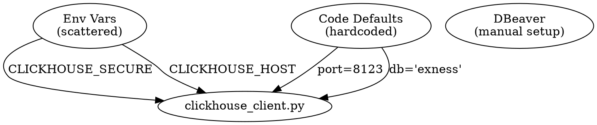
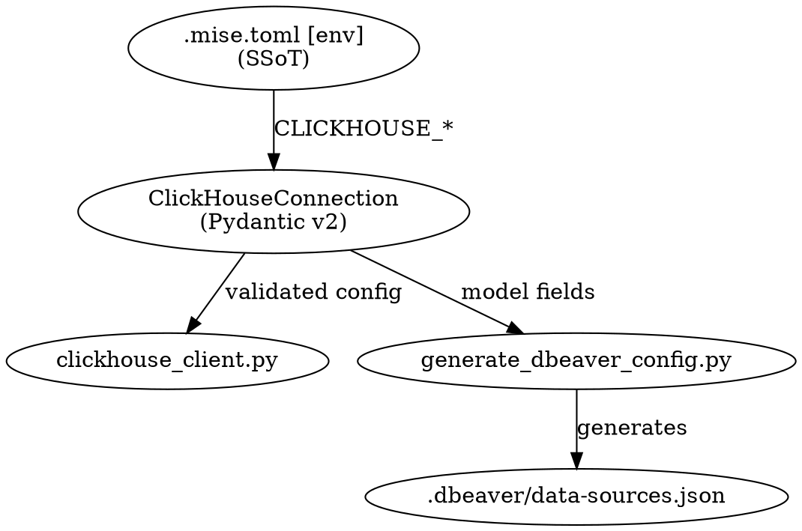
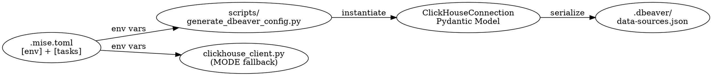

# ADR: ClickHouse Pydantic Config Integration

**Design Spec**: [Implementation Spec](/docs/design/2025-12-10-clickhouse-pydantic-config/spec.md)

## Context and Problem Statement

The `exness-data-preprocess` package has ClickHouse integration for tick data storage, but lacks:

1. **Database client configuration** - No DBeaver connection config generation
2. **SSoT for connection parameters** - Environment variables are scattered, not centralized in mise `[env]`
3. **Inconsistent SSL handling** - Uses `CLICKHOUSE_SECURE` (boolean) instead of canonical `CLICKHOUSE_MODE` (local/cloud) pattern

The `clickhouse-pydantic-config` skill from cc-skills provides a canonical pattern for generating DBeaver configs from Pydantic v2 models using mise as SSoT.

### Before/After

**Before**: Scattered configuration, no DBeaver integration

```
┌────────────────────┐
│   Code Defaults    │
│    (hardcoded)     │ ─┐
└────────────────────┘  │
  │                     │
  │ port=8123           │ db='exness'
  ▼                     ▼
┌────────────────────────────────────────┐
│          clickhouse_client.py          │
└────────────────────────────────────────┘
  ▲                     ▲
  │ CLICKHOUSE_SECURE   │ CLICKHOUSE_HOST
  │                     │
┌────────────────────┐  │
│      Env Vars      │  │
│    (scattered)     │ ─┘
└────────────────────┘
┌────────────────────┐
│      DBeaver       │
│   (manual setup)   │
└────────────────────┘
```

<details>
<summary>graph-easy source (before.dot)</summary>



</details>

**After**: mise `[env]` as SSoT, DBeaver config generation

```
                                             ┌────────────────────────────┐
                                             │      .mise.toml [env]      │
                                             │           (SSoT)           │
                                             └────────────────────────────┘
                                               │
                                               │ CLICKHOUSE_*
                                               ▼
┌──────────────────────┐                     ┌────────────────────────────┐
│ clickhouse_client.py │  validated config   │    ClickHouseConnection    │
│                      │ ◀────────────────── │       (Pydantic v2)        │
└──────────────────────┘                     └────────────────────────────┘
                                               │
                                               │ model fields
                                               ▼
                                             ┌────────────────────────────┐
                                             │ generate_dbeaver_config.py │
                                             └────────────────────────────┘
                                               │
                                               │ generates
                                               ▼
                                             ┌────────────────────────────┐
                                             │ .dbeaver/data-sources.json │
                                             └────────────────────────────┘
```

<details>
<summary>graph-easy source (after.dot)</summary>



</details>

## Research Summary

| Agent Perspective     | Key Finding                                                                                            | Confidence |
| --------------------- | ------------------------------------------------------------------------------------------------------ | ---------- |
| Config-Discovery      | `.mise.toml` has `[env]` section but no CLICKHOUSE\_\* vars; existing `config.py` has Pydantic pattern | High       |
| ClickHouse-Connection | Current code uses `CLICKHOUSE_SECURE` for SSL; port 8123 for HTTP; database default is `exness`        | High       |
| Skill-Reference       | Canonical model uses `CLICKHOUSE_MODE` (local/cloud) with mode-aware validation; scripts at `scripts/` | High       |
| ClickHouse-Pattern    | Three skills form a chain: cloud-management → pydantic-config → architect                              | High       |
| Mise-Pattern          | SSoT pattern: `[env]` section → scripts read via `os.environ.get()` with defaults                      | High       |

## Decision Log

| Decision Area    | Options Evaluated                       | Chosen                               | Rationale                                     |
| ---------------- | --------------------------------------- | ------------------------------------ | --------------------------------------------- |
| SSL Config       | CLICKHOUSE_SECURE vs CLICKHOUSE_MODE    | Hybrid (MODE + SECURE fallback)      | Backward compatibility for existing scripts   |
| Script Location  | inline mise task, src/ module, scripts/ | `scripts/generate_dbeaver_config.py` | Canonical pattern from cc-skills              |
| Database Default | `default` vs `exness`                   | `exness`                             | Match existing codebase convention            |
| Connection Scope | Single mode vs Both local+cloud         | Single per invocation                | Canonical pattern; `--mode` flag for override |

### Trade-offs Accepted

| Trade-off      | Choice         | Accepted Cost                          |
| -------------- | -------------- | -------------------------------------- |
| MODE vs SECURE | Hybrid support | Slightly more complex connection logic |
| PEP 723 script | Standalone     | Script not part of installed package   |

## Decision Drivers

- **SSoT Principle**: All configurable values should live in `.mise.toml` `[env]` section
- **Developer Experience**: Zero-friction local setup, DBeaver integration
- **Backward Compatibility**: Existing `CLICKHOUSE_SECURE` users should not break
- **Canonical Conformity**: Follow cc-skills patterns exactly

## Considered Options

- **Option A**: Full migration to CLICKHOUSE_MODE only
  - Breaks existing scripts using CLICKHOUSE_SECURE

- **Option B**: Keep CLICKHOUSE_SECURE only, skip MODE
  - Deviates from canonical cc-skills pattern

- **Option C**: Hybrid - CLICKHOUSE_MODE primary, CLICKHOUSE_SECURE fallback ← Selected
  - Best of both worlds: canonical pattern + backward compatibility

## Decision Outcome

Chosen option: **Option C (Hybrid)**, because it adopts the canonical `CLICKHOUSE_MODE` pattern from cc-skills while maintaining backward compatibility for any existing automation using `CLICKHOUSE_SECURE`.

## Synthesis

**Convergent findings**: All agents agreed on using mise `[env]` as SSoT, scripts at `scripts/`, and Pydantic v2 models.

**Divergent findings**: Existing code uses `CLICKHOUSE_SECURE`; canonical skill uses `CLICKHOUSE_MODE`.

**Resolution**: Implement hybrid support - MODE takes precedence when set, SECURE as fallback for backward compatibility.

## Consequences

### Positive

- DBeaver config generation with zero manual setup
- mise `[env]` becomes SSoT for all ClickHouse connection parameters
- Follows canonical cc-skills pattern for maintainability
- Backward compatible with existing CLICKHOUSE_SECURE usage

### Negative

- Slightly more complex SSL detection logic in `clickhouse_client.py`
- Additional script file to maintain (`scripts/generate_dbeaver_config.py`)

## Architecture

```
┌──────────────────────┐             ┌────────────────────────────┐                ┌──────────────────────┐              ┌───────────────────┐
│      .mise.toml      │  env vars   │          scripts/          │  instantiate   │ ClickHouseConnection │  serialize   │     .dbeaver/     │
│   [env] + [tasks]    │ ──────────▶ │ generate_dbeaver_config.py │ ─────────────▶ │    Pydantic Model    │ ───────────▶ │ data-sources.json │
└──────────────────────┘             └────────────────────────────┘                └──────────────────────┘              └───────────────────┘
  │
  │ env vars
  ▼
┌──────────────────────┐
│ clickhouse_client.py │
│   (MODE fallback)    │
└──────────────────────┘
```

<details>
<summary>graph-easy source</summary>



</details>

## References

- [clickhouse-pydantic-config skill](/Users/terryli/eon/cc-skills/plugins/devops-tools/skills/clickhouse-pydantic-config/)
- [mise-configuration skill](/Users/terryli/eon/cc-skills/plugins/itp/skills/mise-configuration/)
- [ADR: mise env centralized config](/docs/adr/2025-12-08-mise-env-centralized-config.md) (if exists)
